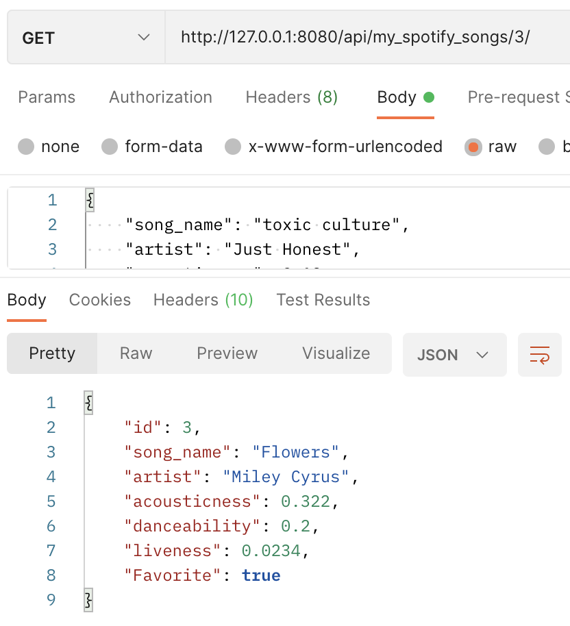
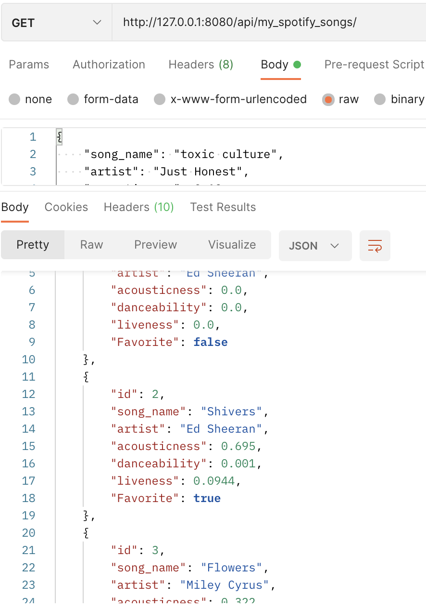
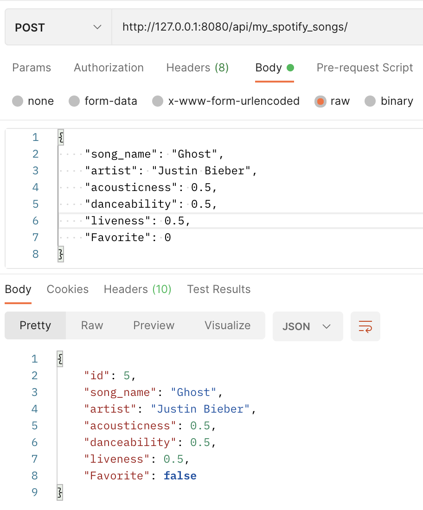
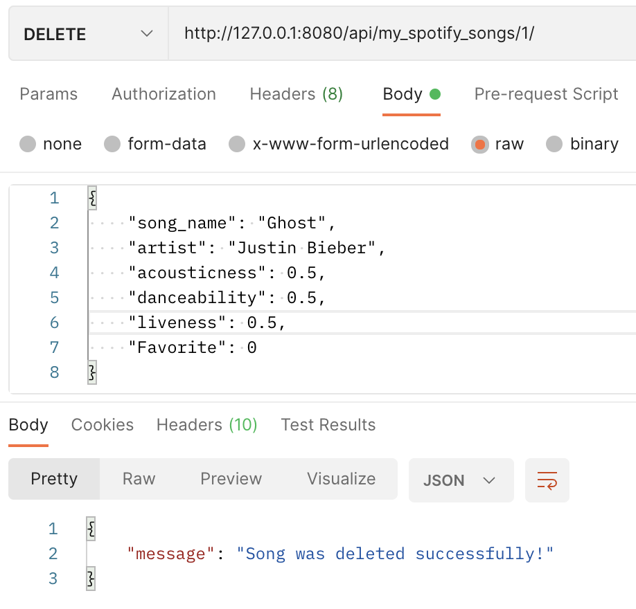
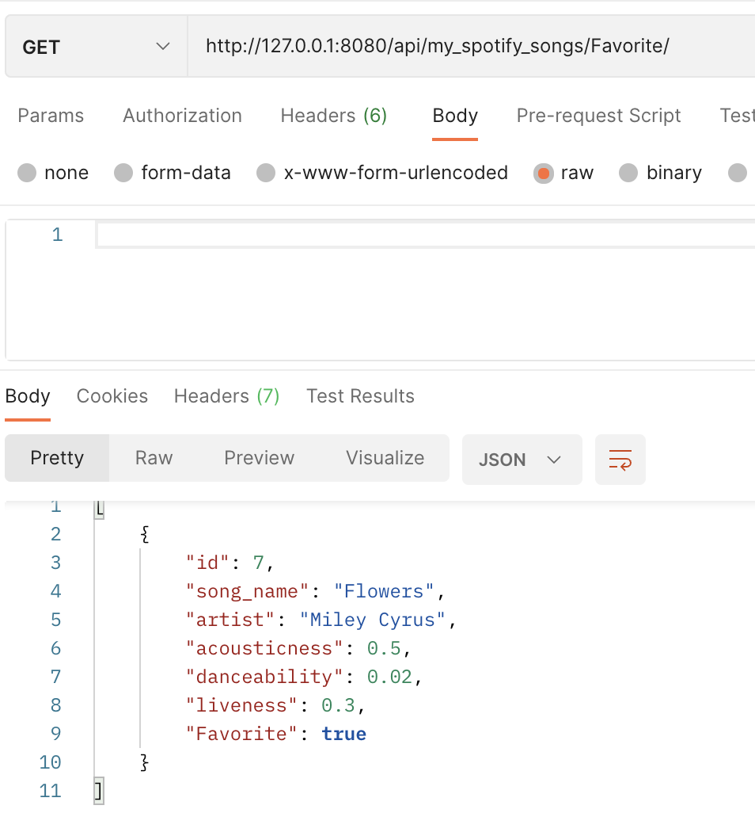
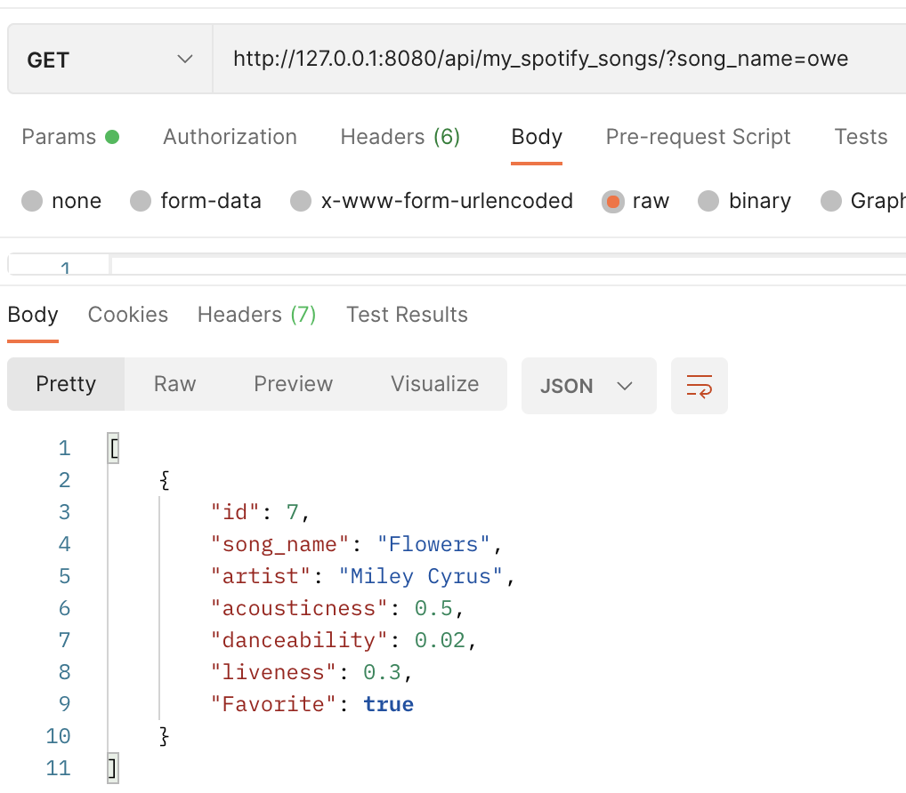
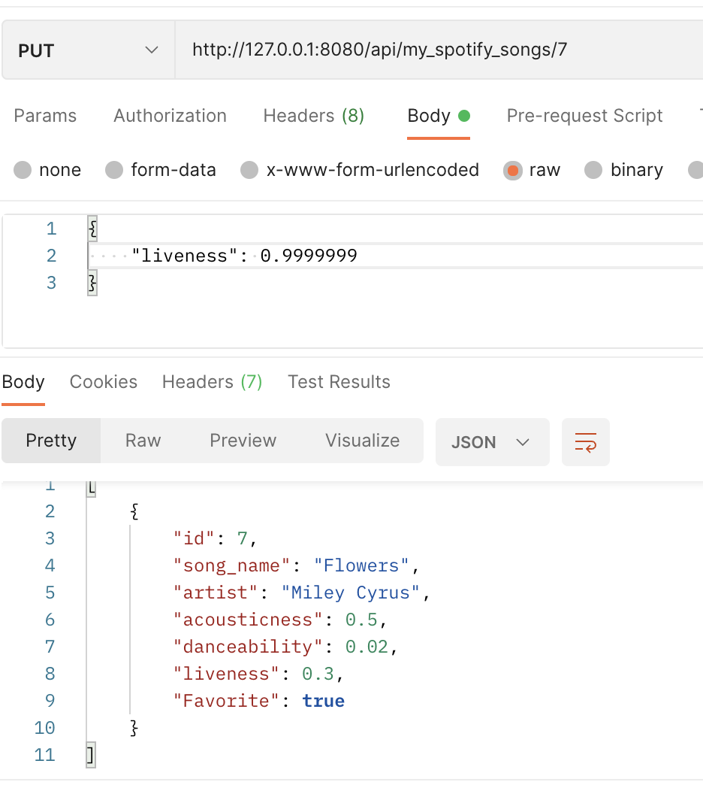
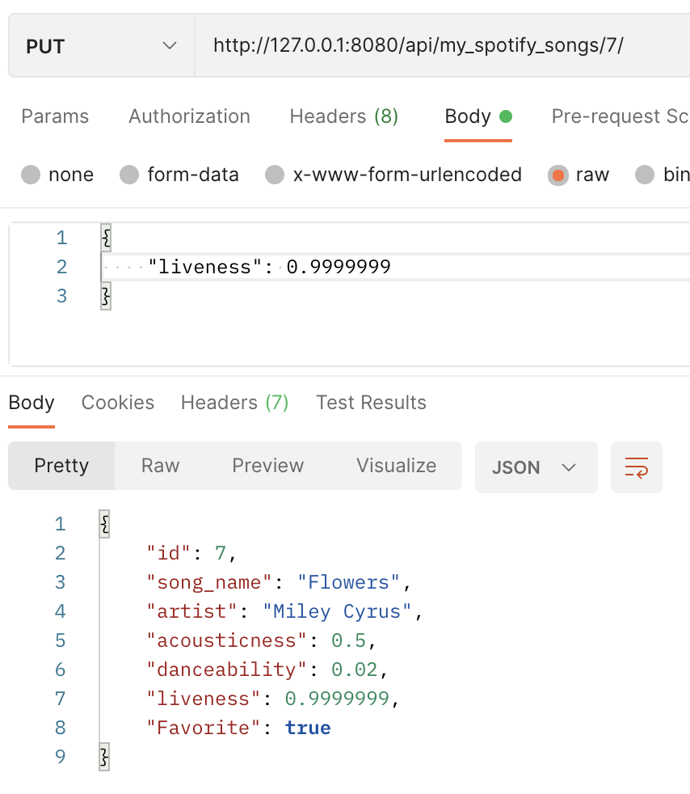

#### Project Init
```
python3 -m venv dj
. dj/bin/activate
pip install djangorestframework
django-admin startproject DjangoRestApiMongoDB
pip install djongo
```
Note: 
- `pip install pymongo==3.12.1` for avoiding `Database objects do not implement truth value testing or bool()` error!
- `pip install djongo==1.3.3` for solving SQLdecoder error.
  
Follow the [tutorial](https://www.bezkoder.com/django-mongodb-crud-rest-framework/) to do the following steps.

#### MongoDB set up
Follow this [intructions](https://www.mongodb.com/docs/manual/tutorial/install-mongodb-on-os-x/#std-label-install-with-homebrew) according to your system.
Note: Django 4.0+ has changed some features, be aware!
- Changefrom `django.conf.urls import url` to `from django.urls import re_path` in `urls.py`

```
// MacOS example
brew tap mongodb/brew
brew update
brew install mongodb-community@6.0
brew services start mongodb-community@6.0

// Connect and Use MongoDB
mongotop
```
#### Implement Results.

<table border="0">
 <tr>
    <td>GET a song by id</td>
    <td>GET all songs</td>
 </tr>
 <tr>
    <td>POST new song</td>
    <td>DELETE</td>
 </tr>
 <tr>
    <td>GET by Favorite filter</td>
    <td>GET name by an input string filter</td>
 </tr>
 <tr>
    <td>Before UPDATE</td>
    <td>After UPDATE</td>
 </tr>

</table>

